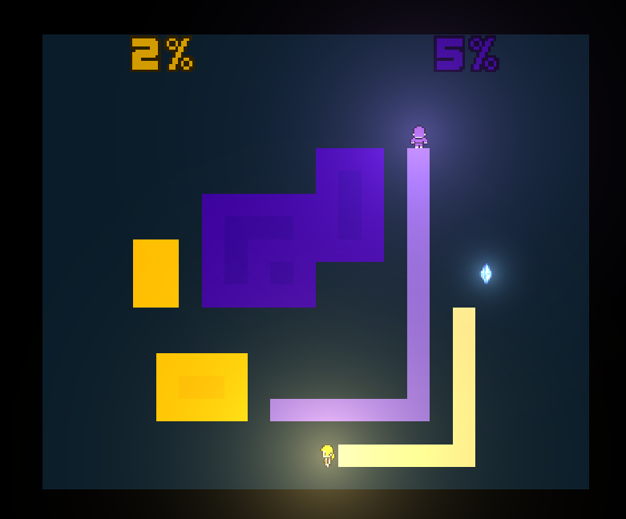

# (TODO: your game's title)

Author: (TODO: your name)

Design: (TODO: In two sentences or fewer, describe what is new and interesting about your game.)

Networking: (TODO: How does your game implement client/server multiplayer? What is transmitted? Where in the code?)

Screen Shot:

How To Play:

(TODO: describe the controls and (if needed) goals/strategy.)

Sources: (TODO: list a source URL for any assets you did not create yourself. Make sure you have a license for the asset.)
Background music via [Fesliyan Studios] (https://www.fesliyanstudios.com/royalty-free-music/downloads-c/8-bit-music/6)  
Walking sound effect via [soundbible] (http://soundbible.com/789-Cartoon-Walking.html)  
New connected player sound effect via [Zapsplat] (https://www.zapsplat.com/sound-effect-category/button-clicks/)  
Success / achievement sound effect via [Zapspat] (https://www.zapsplat.com/?s=game+success+sound&post_type=music&sound-effect-category-id=)  

This game was built with [NEST](NEST.md).

